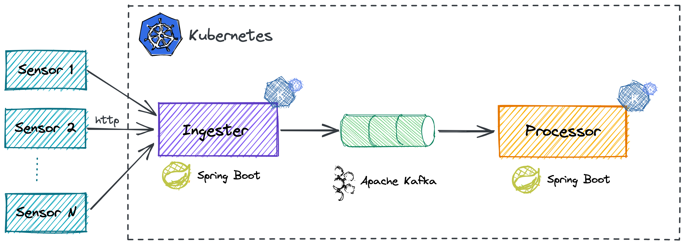

# Knative Demo on EKS

## Introduction

This knative demo is composed of two [Spring Boot](https://spring.io/projects/spring-boot) applications: the ingester
and the processor. The ingester receives measures from several sensors in json format and those are persisted in a Kafka
topic. Meanwhile, the processor processes the Kafka events in background. 



## EKS cluster creation

We will use [eksctl](https://eksctl.io) to create a kubernetes cluster on [EKS](https://aws.amazon.com/eks/). By default the cluster is
created with two `m5.large` worker nodes. 

```shell
eksctl create cluster
```

## Kafka installation

We will use [Strimzi](https://strimzi.io/) to install a single node Kafka and Zookeeper on Kubernetes.

```shell
export STRIMZI_VERSION=0.23.0

kubectl create namespace kafka
kubectl create -f https://strimzi.io/install/$STRIMZI_VERSION?namespace=kafka -n kafka
kubectl apply -f https://strimzi.io/examples/$STRIMZI_VERSION/kafka/kafka-persistent-single.yaml -n kafka

kubectl wait kafka/my-cluster --for=condition=Ready --timeout=300s -n kafka
```

## Knative Serving and Kourier installation

We will use [Kourier](https://github.com/knative-sandbox/net-kourier) as Ingress for Knative Serving. Kourier is a 
lightweight alternative for the Istio ingress as its deployment consists only of an Envoy proxy and a control plane for 
it.

```shell
export KNATIVE_VERSION=v0.23.0

kubectl apply -f https://github.com/knative/serving/releases/download/$KNATIVE_VERSION/serving-crds.yaml
kubectl apply -f https://github.com/knative/serving/releases/download/$KNATIVE_VERSION/serving-core.yaml
kubectl wait deployment --all --timeout=-1s --for=condition=Available -n knative-serving

kubectl apply -f https://github.com/knative/net-kourier/releases/download/$KNATIVE_VERSION/kourier.yaml
kubectl wait deployment --all --timeout=-1s --for=condition=Available -n kourier-system
kubectl wait deployment --all --timeout=-1s --for=condition=Available -n knative-serving

kubectl patch configmap/config-network \
  --namespace knative-serving \
  --type merge \
  --patch '{"data":{"ingress.class":"kourier.ingress.networking.knative.dev"}}'

# Configured for EKS  
export EXTERNAL_IP=kubectl --namespace kourier-system get service kourier -o jsonpath='{.status.loadBalancer.ingress[0].hostname}'

# Configure a real DNS (kcdspain.arima.eu) 
# For other alternatives: https://knative.dev/docs/install/install-serving-with-yaml/#configure-dns
kubectl patch configmap/config-domain \
  --namespace knative-serving \
  --type merge \
  --patch '{"data":{"kcdspain.arima.eu":""}}'
```

## Knative Eventing installation

We will do the simplest installation of Knative Eventing, without a broker and a messaging layer.

```shell
export KNATIVE_VERSION=v0.23.0

kubectl apply -f https://github.com/knative/eventing/releases/download/$KNATIVE_VERSION/eventing-crds.yaml
kubectl apply -f https://github.com/knative/eventing/releases/download/$KNATIVE_VERSION/eventing-core.yaml
kubectl wait deployment --all --timeout=-1s --for=condition=Available -n knative-eventing
```

## Building and Deployment

### Ingester (Knative Serving demo application) 

Build container image with:

```shell
./mvnw compile jib:build
```

Deploy with:

```shell
kn service create ingester --image=itelleria/ingester:v1.0
```

Check that the application is running:

```shell
curl http://demo-knative-serving.default.kcdspain.arima.eu/actuator/health
```

### Processor (Knative Eventing demo application) 

Build container image with:

```shell
./mvnw compile jib:build
```

Deploy with:

```shell
kn service create processor --image=itelleria/processor:v1.0
```

Create a Kafka Event Source:

```shell
kubectl apply -f measures-kafka-source.yaml
```

## Load Tests execution

To run the JMeter tests in non gui mode run this command:

```shell
jmeter -n -t measure-load-test.jmx
```

Some test parameters can be configured, for example:

````shell
jmeter -n -t measure-load-test.jmx -Jnumber-of-sensors=10 -Jnumber-of-loops=20
````

## Configure delays and concurrency

You can try different different delays and concurrencies to see how Knative Eventing behaves.

```shell
kn service update processor --concurrency-target 3
kn service update processor --env app.delay=5000
```

In this demo, Knative Eventing's scalability depends on how many partitions are configured in `measures` Kafka topic. By
default, the amount of partitions is 1. Use this command to change it:

```shell
kubectl edit -n kafka KafkaTopic/measures
```

## Kafka Cli Consumer and Producer

```shell
kubectl -n kafka run kafka-producer -ti --image=strimzi/kafka:0.14.0-kafka-2.3.0 --rm=true --restart=Never -- bin/kafka-console-producer.sh --broker-list my-cluster-kafka-bootstrap:9092 --topic measures

kubectl -n kafka run kafka-consumer -ti --image=quay.io/strimzi/kafka:0.23.0-kafka-2.8.0 --rm=true --restart=Never -- bin/kafka-console-consumer.sh --bootstrap-server my-cluster-kafka-bootstrap:9092 --topic measures --from-beginning
kubectl -n kafka run kafka-consumer-by-partition -ti --image=quay.io/strimzi/kafka:0.23.0-kafka-2.8.0 --rm=true --restart=Never -- bin/kafka-console-consumer.sh --bootstrap-server my-cluster-kafka-bootstrap:9092 --topic measures --from-beginning  --partition 0

kubectl -n kafka run kafka-topics -ti --image=quay.io/strimzi/kafka:0.23.0-kafka-2.8.0 --rm=true --restart=Never -- bin/kafka-topics.sh --bootstrap-server my-cluster-kafka-bootstrap:9092 --topic measures --describe  
```
